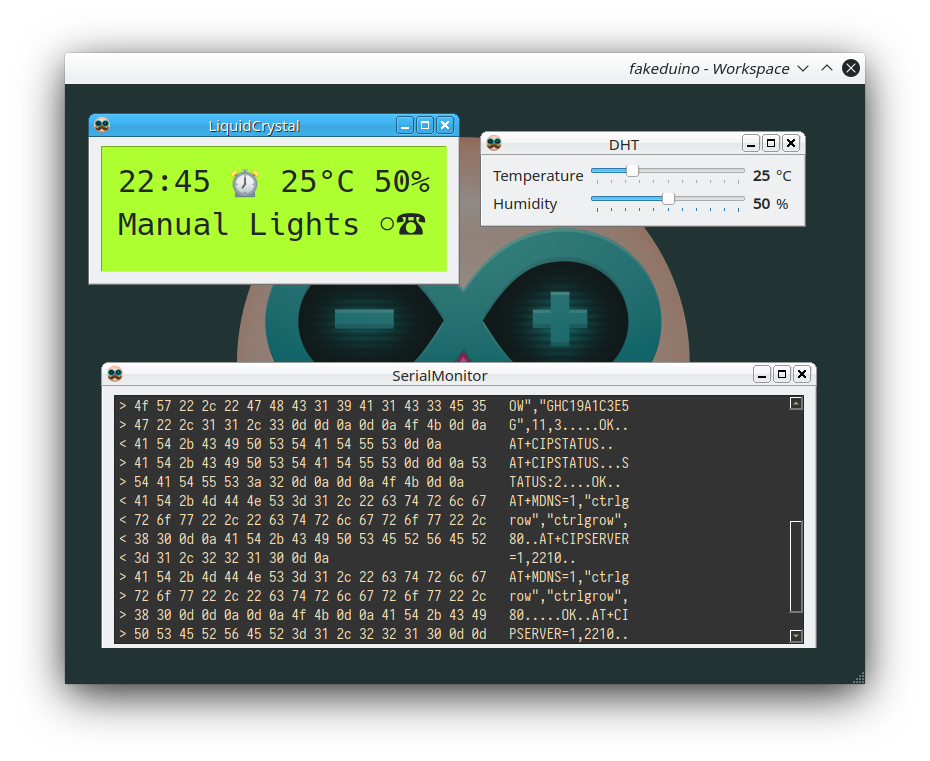

# fakeduino

Code-compatible (yet incomplete) implementation of Arduino API for testing ahd debugging sketches on the desktop

A Qt aaplication that allows for the joint compilation of arduino sketches, to be tested on the desktop.

Currently it can simulate a 16x2 LCD, a DHT, and button inputs. Also allows the sketch to use a real serial port, with a builtin serial monitor.
New components can be added with ease if a future project requires.
